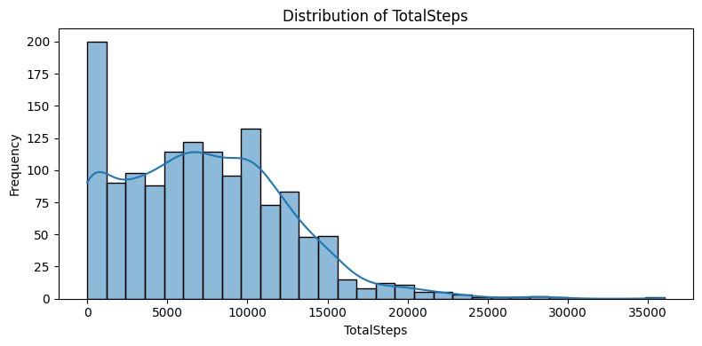

# 2025_ia651_raavi_govindagari
Code for 2025 IA651 Final Project. Teammates Poorna Raavi and Shiva Prasad

Course: Machine Learning
# Project Title: Calorie Burn Prediction using Fitbit Data
## Project Overview
The project focuses on using Machine Learning (ML) models to predict calories burned by a person using their activity
## Project Goals
Try all models and predict calories
## Dataset Details
### Motivation
We used the Fitbit Fitness Tracker dataset from Kaggle, which captures physical activity and health data for multiple users over a period of time. The dataset includes: 
- Total steps in day
- Total Distance
- Very/Fairly/Lightly Active Minutes
- Sedentary Minutes
- Calories

**Source**: [[kaggle-Fitbit Fitness Tracker Data](https://www.google.com/url?q=https%3A%2F%2Fwww.kaggle.com%2Fdatasets%2Farashnic%2Ffitbit%2Fdata)]
This dataset is useful in understanding user behavior and estimating energy expenditure patterns, which can support fitness goals and health recommendations.

### Problem Statement
The goal of this project is to predict how many calories a person will burn based on their activity levels and other physical metrics.
### Why is this useful?
Accurately predicting calorie expenditure can:
- Help users better manage their fitness goals
- Enable health apps to provide more personalized recommendations
- Assist in early detection of irregular activity patterns
### Process Overview
1. Data Preprocessing
- Handling missing values
- Scaled/normalizing numeric features
2. Exploring Data Analysis(EDA)
- Visualized distributions and correlations
- Indentifying key features impacting calories burn
3. Models
- Tried regression models like
    - Linear Regression
    - L1 & L2
    - Decision Tree Regression
    - Support Vector Regressor
    - Voting Regressor
    - Bagging Regressor
    - Out of Bagging Regressor
    - Ada Boosting Regressor
    - Random Forest Regressor
    - Gradient Boosting Regression
    - XGBoost
4. Evaluation
- Tested all models on test dataset
- Evaluated the predictions by each model on test set
- Interpreted model behavior using feature importance
### EDA
- X is all the features:
features = [
    'TotalSteps',
    'TotalDistance',
    'VeryActiveMinutes',
    'FairlyActiveMinutes',
    'LightlyActiveMinutes',
    'SedentaryMinutes',
    'Calories'
]
& y is calories column
- The problem is regression problem beacuse we are predicting calories burned which is a continous values.
- The number of observations we have 1373 entries
- Distribution of each feature is as follows:

.png)
.png)
.png)
.png)